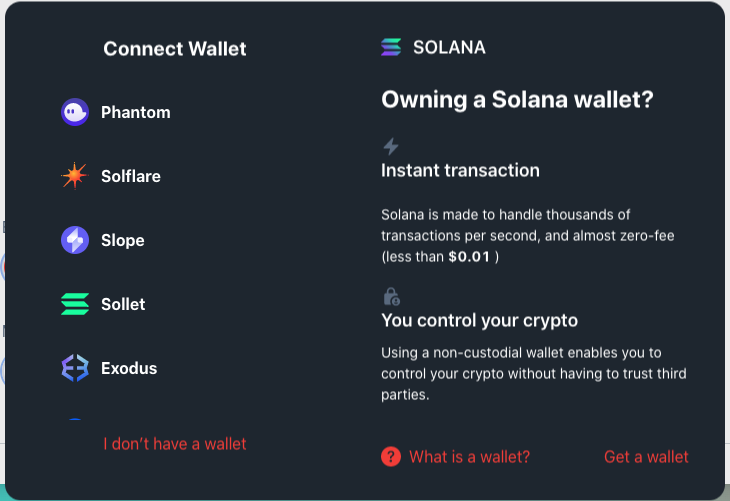

  

# Solkit
The easiest way to connect a wallet on Solana

## Features
- 🔥 Supports the most popular solana wallet adapters.
- 💅 Fully customize wallet adapters, color, border radius and a lot more.
- 🎨 Beautiful Themes — Predesigned themes or full customization.
- 💫 User-Friendly UX and straightforward experience.

## Quick start
Coming soon
## Documentation
Coming soon
## Examples
Coming soon
## Run examples locally
Clone the ConnectKit project and install the dependencies:
```sh
$ git clone git@github.com:trankhacvy/solkit.git
$ cd solkit
$ yarn install
```
then start the demo
```sh
$ yarn dev
```

## Contribute
Coming soon

## License
Coming soon